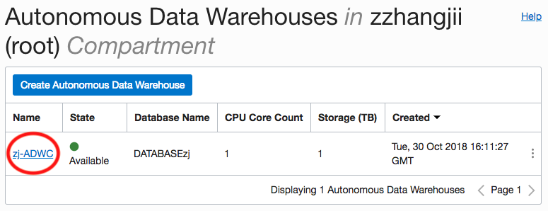
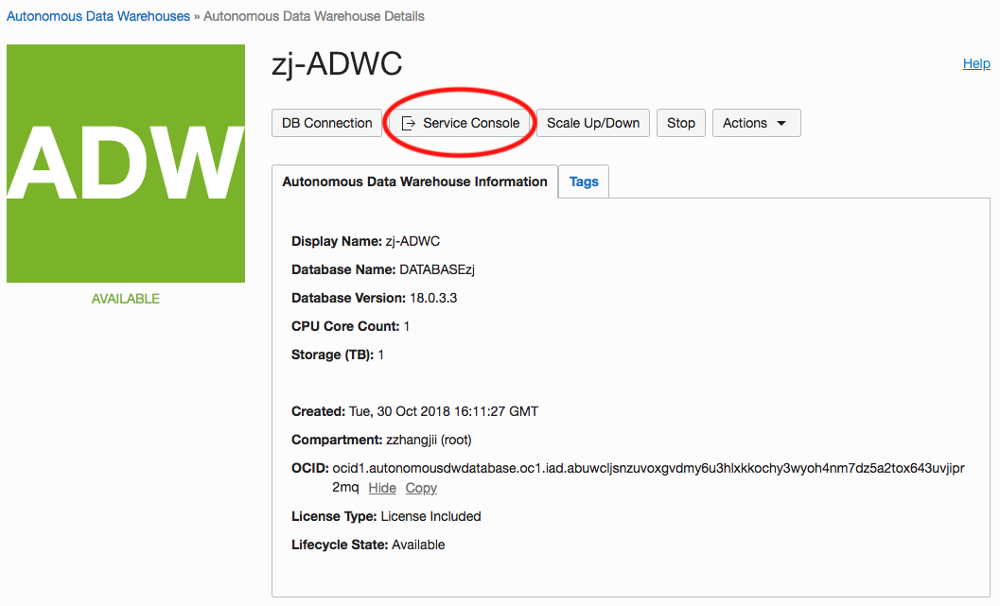
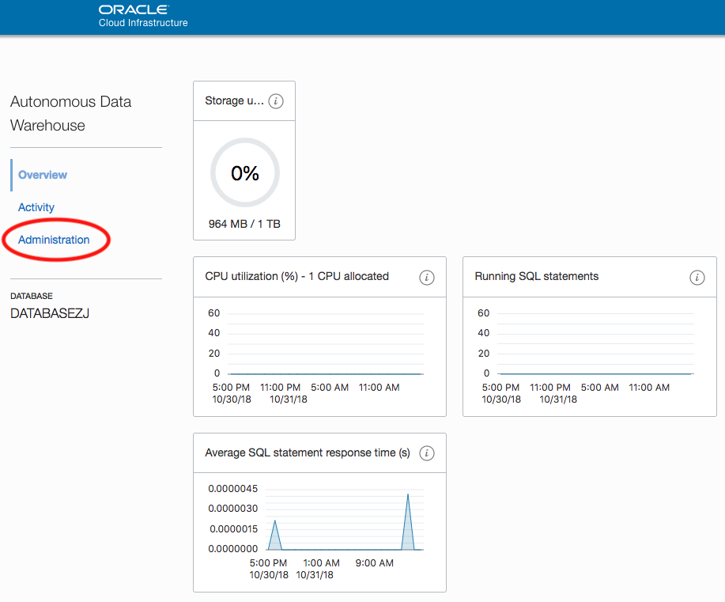
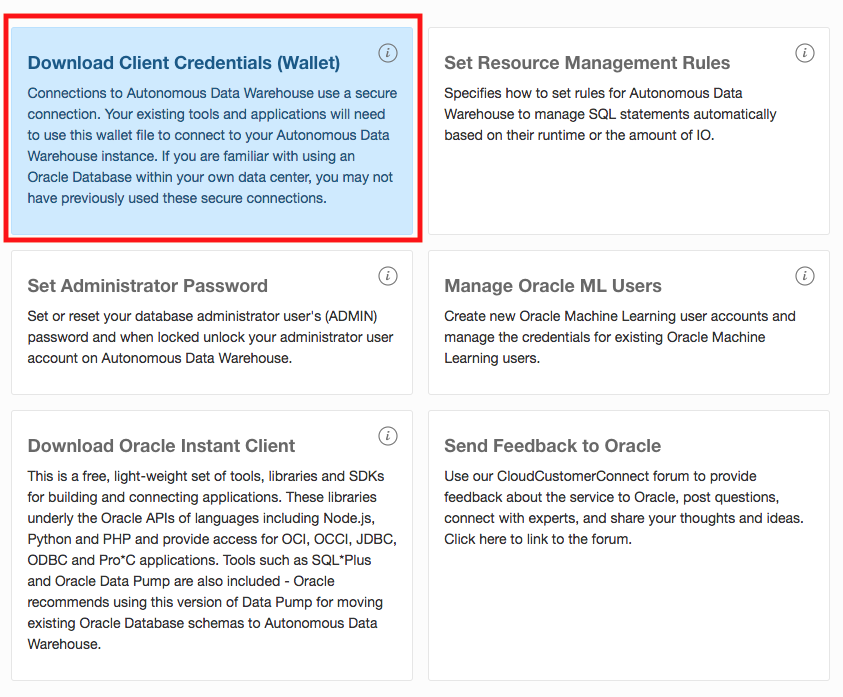
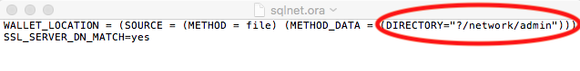
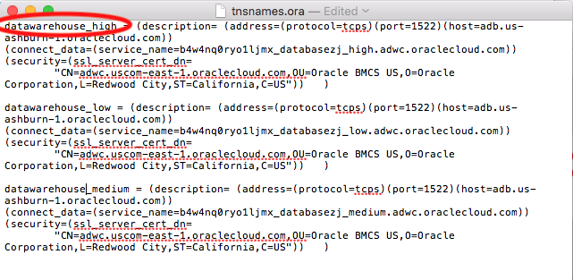
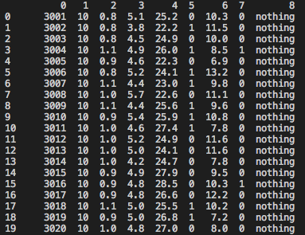

# Connecting to an Oracle Data Warehouse using Python
This is a simple walkthrough to get connected to an Oracle Datawarehouse using Python. You will be making this connection with Oracle's package cx_Oracle.

## Getting Started
Before starting this quick guide, you should have already provisioned an Oracle Autonomous Data Warehouse and have access to the details specified during provisioning.

## Prerequisites

* Access to a provisioned Oracle Data Warehouse

* Python 3.5+

* cx_Oracle package

* pandas package

* Oracle Instant Client 

If missing packages, install cx_Oracle and pandas using pip:

```
pip install cx_Oracle
pip install pandas
```

**Important**

If missing Oracle Instant Client, follow this guide (Make sure to use the steps specified for your operating system):

https://oracle.github.io/odpi/doc/installation.html#macos


## Download Wallet File 

Log in to your OCI Account and access the Autonomous Datawarehouse Page. Click the name of the Datawarehouse:



Click on the service console button.



Thereafter click on the Administration tab on the left-hand side.



Then click on the Download Client Credentials (Wallet) and enter the password created when provisioning the ADW instance, and click the Download button. Extract this zip file and note its location as it will be used later on. 



## Editing sqlnet.ora

Within the wallet file there is a file called sqlnet.ora. Open this file with your favorite text editor and replace the path "?/network/admin" set for DIRECTORY with the path of the extracted wallet you found noted earlier, something like "/Users/johndoe/Downloads/Wallet_DBNAME". The path is shown below:



## Choosing a Connection.

Within the Wallet File open tsnames.ora, and select the connection for your needs:

* High: The High database service provides the highest level of resources to each SQL statement resulting in the highest performance, but supports the fewest number of concurrent SQL statements.

* Medium: The Medium database service provides a lower level of resources to each SQL statement potentially resulting a lower level of performance, but supports more concurrent SQL statements.

* Low: The Low database service provides the least level of resources to each SQL statement, but supports the most number of concurrent SQL statements.

For this example I selected first connection name.



You will need this name for the next step. 

## Making the Connection with cx_Oracle in Python

Here you need the the path of the unzipped wallet used previously, a username (ADMIN by default), and the password set while provisiong your Datawarehouse.

```python
import cx_Oracle # necessary packages
import os #needed to set path
import pandas as pd
os.environ['TNS_ADMIN'] = '/Users/johndoe/Downloads/Wallet_DBNAME' #change this to the path of your wallet file
con = cx_Oracle.connect(user = 'ADMIN',password = 'bXgsQd5MbXgsQd5M',dsn = 'datawarehouse_high')#Enter your log-in creditions (ADMIN is the user created by default, the password is the one specified while provisioning)
#the dsn is the name of the connection chosen in the previous step
cursor = con.cursor()
cursor.execute("SELECT * FROM HRDATA")
hrdata = pd.DataFrame(cursor.fetchall())
print(hrdata)
```



Within the cursor.execute() statement you can type any SQL statements you need, accessing the results with cursor.fetchall() enabling you to interact directly with the Data Warehouse within a python script. For further details, check out cx_Oracle's documentation here: https://cx-oracle.readthedocs.io/en/latest/.

*By Carl Lejerskar, last updated October 31, 2018*


